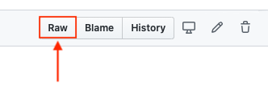

# LittleSnitchRules
Collection of LittleSnitch rules

To get a rule, it is necessary to use the raw link of each rule file.

For example:

`https://raw.githubusercontent.com/TKalippke/LittleSnitchRules/master/rules/FacebookBlocker.lsrules

To get the path to the raw file, click the rule and in the view click "raw" to open the raw file in the browser:

After that copy the browser path for little snitch.